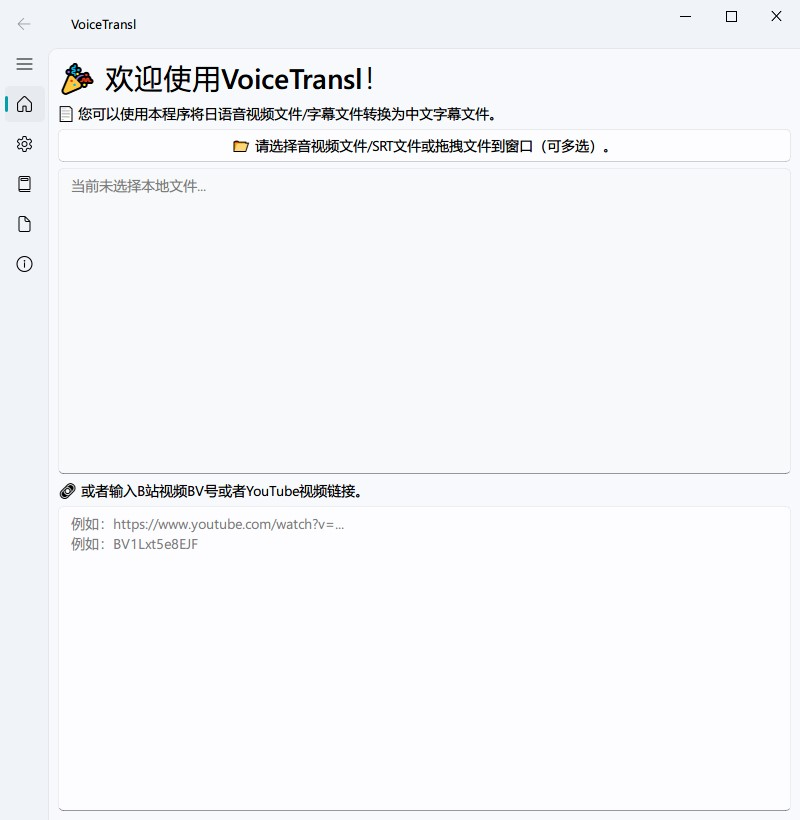

<h1><p align='center' >GalTransl for ASMR</p></h1>
<div align=center>      </div>

GalTransl for ASMR是一个离线AI视频字幕生成和翻译软件，您可以使用本程序将日语音视频文件/字幕文件转换为中文字幕文件。详细说明请见 [视频教程](https://www.bilibili.com/video/BV1ZoUYYXEio)。

<div align=center></div>

## 特色

* 支持多种翻译模型，包括在线模型（GPT3.5、GPT4、Moonshot、Minimax、Qwen、GLM、Deepseek及任意OpenAI兼容接口）和本地模型（Sakura、Index、Galtransl及任意llama.cpp，Ollama模型）。
* 支持AMD/NVIDIA/Intel GPU加速，翻译引擎支持调整显存占用。
* 支持多种输入格式，包括音频、视频、SRT字幕。
* 支持多种输出格式，包括SRT字幕、LRC字幕。
* 支持字典功能，可以自定义翻译字典，替换输入输出。
* 支持从YouTube/Bilibili直接下载视频。
* 支持文件和链接批量处理，自动识别文件类型。

## 下载

从Release页面下载最新版本的[GalTransl for ASMR](https://github.com/shinnpuru/GalTransl-for-ASMR/releases)，解压后运行`app.exe`。

## 听写（NVIDIA推荐）

听写模型基于[faster-whisper](https://github.com/Purfview/whisper-standalone-win)引擎，请根据[配置要求](whisper-faster/README.md)准备DLL和EXE文件。

模型需要自行下载，请选择合适的模型下载然后放到`whisper-faster`文件夹。

| 名称  | 磁盘    | 显存     | 链接 |
| ------ | ------- | ------- | ----- |
| faster-whisper-small  | 463 MiB | ~1 GB | [下载](https://huggingface.co/Systran/faster-whisper-small) |
| faster-whisper-medium | 1.42 GiB | ~2 GB | [下载](https://huggingface.co/Systran/faster-whisper-medium) |
| faster-whisper-large-v2  | 2.87 GiB | ~3 GB | [下载](https://huggingface.co/Systran/faster-whisper-large-v2) |

## 听写（AMD/Intel推荐）

听写模型基于[whisper.cpp](https://github.com/ggerganov/whisper.cpp)引擎，已经为Vulkan编译配置好。

模型需要自行下载，请选择合适的模型下载然后放到`whisper`文件夹。

| 名称 | 磁盘    | 显存     | 链接 |
| ------ | ------- | ------- | ----- |
| ggml-small.bin  | 466 MiB | ~852 MB | [下载](https://huggingface.co/ggerganov/whisper.cpp/resolve/main/ggml-small.bin?download=true) |
| ggml-medium.bin | 1.5 GiB | ~2.1 GB | [下载](https://huggingface.co/ggerganov/whisper.cpp/resolve/main/ggml-medium.bin?download=true) |
| ggml-large-v2.bin  | 2.9 GiB | ~3.9 GB | [下载](https://huggingface.co/ggerganov/whisper.cpp/resolve/main/ggml-large-v2.bin?download=true) |

## 翻译

1. 在线模型支持任意的OpenAI兼容接口，以及国内各大模型。具体列表如下：

```
    "gpt-custom",
    "gpt35-1106",
    "gpt4-turbo",
    "moonshot-v1-8k",
    "deepseek-chat",
    "glm-4",
    "glm-4-flash",
    "qwen2-7b-instruct",
    "qwen2-57b-a14b-instruct",
    "qwen2-72b-instruct",
    "abab6.5-chat",
    "abab6.5s-chat",
```

2. 本地翻译模型基于[llama.cpp](https://github.com/ggerganov/llama.cpp)引擎，已经为Vulkan编译配置好。

模型需要自行下载，请选择合适的llama.cpp模型下载然后放到`llama`文件夹。

| 模型  | 磁盘    | 显存     | 链接 |
| ------ | ------- | ------- | ----- |
| [Index-1.9B-Q4](https://github.com/bilibili/Index-1.9B)  | 1.24 MiB | ~4G | [下载](https://huggingface.co/IndexTeam/Index-1.9B-Chat-GGUF/resolve/main/ggml-model-Q4_K_M.gguf?download=true) |
| [Sakura-7B-Q4](https://github.com/SakuraLLM/SakuraLLM)  | 4.56 GiB | ~8 GB | [下载](https://huggingface.co/SakuraLLM/Sakura-7B-LNovel-v0.9-GGUF/resolve/main/sakura-7b-lnovel-v0.9-Q4_K_M.gguf?download=true) |
| [GalTransl-7B-Q6](https://github.com/xd2333/GalTransl) | 5.9 GiB | ~11 GB | [下载](https://huggingface.co/SakuraLLM/GalTransl-7B-v2.5/resolve/main/GalTransl-7B-v2-Q6_K.gguf?download=true) |
| [Sakura-13B-Q4](https://github.com/SakuraLLM/SakuraLLM)  | 9.45 GB | ~16 GB | [下载](https://huggingface.co/SakuraLLM/Sakura-14B-LNovel-v0.9b-GGUF/resolve/main/sakura-13b-lnovel-v0.9b-Q4_K_M.gguf?download=true) |

3. 如果需要使用Ollama或者其他本地模型引擎，请使用gpt-custom接口，并配置自定义OpenAI地址为`http://localhost:11434`，具体请参考[OpenAI兼容性](https://ollama.com/blog/openai-compatibility).

## 常见问题

1. All connection attempts failed

在线模型请检查网络连接是否正常，或者尝试更换代理。离线模型出现连接错误，先检查是否超显存，把离线参数从0开始逐步增加10；然后确认关闭所有的代理软件，在系统设置-网络和Internet-代理里面应该是空的。

2. 多次使用之后闪退

缓存文件中可能存在问题，可以尝试清理下载缓存，或者重新解压程序到一个新的目录。

3. 输出日志乱码

请检查系统编码是否为UTF-8，Windows控制面板-区域-更改日期、时间或数字格式-管理-更改系统区域设置-使用UTF-8提供全球语言支持。

4. 我没有显卡可以用吗

可以使用在线镜像进行运行，不需要显卡，详细请参考[镜像部署](https://www.codewithgpu.com/i/shinnpuru/GalTransl-for-ASMR/GalTransl-for-ASMR)。

5. 我不是Windows系统可以用吗

Linux可以使用服务器部署进行运行，详细请参考[server分支](https://github.com/shinnpuru/GalTransl-for-ASMR/tree/server)。MacOS暂时不支持，用户可以使用[镜像部署](https://www.codewithgpu.com/i/shinnpuru/GalTransl-for-ASMR/GalTransl-for-ASMR)。

## 开发

1. 安装依赖
```
pip install -r requirements.txt
```

2. 构建程序
```
pyinstaller app.spec
```

## 声明

本软件仅供学习交流使用，不得用于商业用途。本软件不对任何使用者的行为负责，不保证翻译结果的准确性。使用本软件即代表您同意自行承担使用本软件的风险，包括但不限于版权风险、法律风险等。请遵守当地法律法规，不要使用本软件进行任何违法行为。
